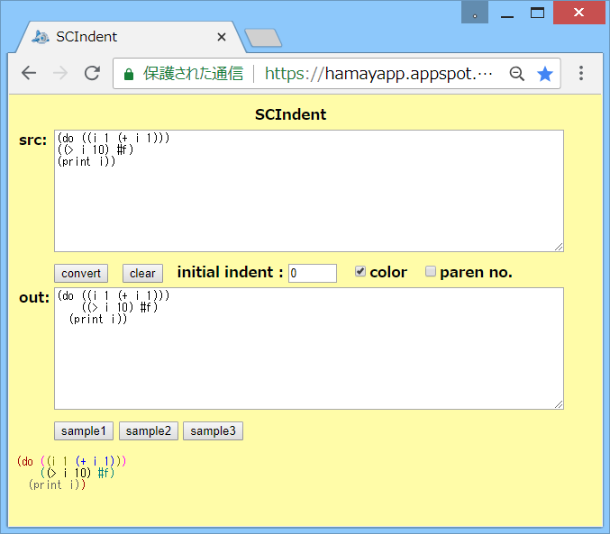

# SCIndent



## 概要
- Schemeのプログラムのインデント変換を行うHTMLです。

- Schemeのプログラムを作成する場合、  
  テキストエディタにインデント(字下げ)を支援する機能がなければ、  
  ユーザが自分で空白を入力する必要があります。  
  本アプリは、この空白の入力を支援するための簡易ツールです。

- 実行例は、以下のページにあります。  
  https://hamayapp.appspot.com/static/scindent.html


## 使い方
- scindent.html を ブラウザで開くと起動します。

- srcのテキストボックスにSchemeのプログラムを貼り付けて、  
  convertボタンをクリックすると、インデント変換を実行します。  
  結果は、outのテキストボックスに表示されます。  
  また、その下には括弧ごとに色分けした結果も表示されます。

- initial indentのテキストボックスに数値を入力すると、  
  変換時の初期インデント量を設定できます。  
  プログラムの途中の部分のみを変換する場合等に利用ください。

- また、colorのチェックボックスのチェックを外すと、  
  色を付けなくなります。

- また、paren no.のチェックボックスにチェックを入れると、  
  括弧のとなりに番号を表示します。  
  開き括弧と閉じ括弧の対応を確認したい場合等に利用ください。

- clearボタンをクリックすると、入出力をすべてクリアします。

- sample1-3ボタンをクリックすると、変換の例を表示します。

- 変換を実行しても変化がなかった場合には [ no change ] と表示します。


## 注意事項
1. インデントの単位は、半角スペース2個に固定です。

2. 入力にタブ文字があった場合には、半角スペース4個として計算します。  
   (出力は半角スペースのみになります(リテラル内を除く))

3. 対応している構文キーワードについては、  
   HTML内の keyword_table に設定が記述されています。

4. 以下のコメント形式に対応しています。
   ```
     1行コメント                     ;
     ハッシュバン(*1)                #!
     複数行コメント(*2)              #|～|#
     S式コメント                     #;
     (*1)ハッシュバンは1行コメントとして扱っています
     (*2)複数行コメント(#|～|#)は、インデントを変更しません
   ```

5. 以下のリテラルに対応しています。
   ```
     シンボル                        |～|
     文字                            #\a
     文字列                          "～"
     ベクタ                          #(～)
     文字集合(*1)                    #[～]
     正規表現(*1)                    #/～/ および #/～/i
     デバッグマクロ(*1)              #?=
     不完全文字列(*1)                #*"～"
     補間文字列(*1)                  #"～"
     旧補間文字列(*1)                #`"～"
     アンインターンドシンボル(*1)    #:foo
     ユニフォームベクタ(SRFI-4)(*2)  #u8(～) #s8(～) #f64(～) 等
     リーダ構築子構文(SRFI-10)       #,(～)
     (*1)Gauche専用です
     (*2)R7RSに#u8(～)が存在します
   ```


## 環境等
- OS
  - Windows 8.1 (64bit)
- ブラウザ
  - Chrome v55

## 履歴
- 2015-1-6   v1.00 (初版)
- 2015-1-7   v1.01 一部処理見直し(div→span)
- 2015-1-7   v1.02 空文字列等の解析ミス修正
- 2015-1-8   v1.03 一部処理見直し(escape_html追加等)
- 2015-1-8   v1.04 一部処理見直し(escape_html等)
- 2015-1-8   v1.05 一部処理見直し(make_space等)
- 2015-1-8   v1.06 インデント計算ミス修正(括弧のネストでずれる)
- 2015-1-8   v1.07 一部処理見直し(括弧対応チェック等)
- 2015-1-9   v1.08 キーワードと色テーブル見直し
- 2015-1-9   v1.09 コメント修正のみ
- 2015-1-9   v1.10 インデント計算ミス修正(開き括弧直後の複数改行でずれる)(クォートでずれる)
- 2015-1-10  v1.11 一部処理見直し(変数初期化追加)
- 2015-1-10  v1.12 インデント計算ミス修正(文字リテラルの記号対応)(#false対応)
- 2015-1-10  v1.13 文字リテラルの記号見直し。デリミタ見直し。波括弧対応
- 2015-1-10  v1.14 クォートリストの角括弧、波括弧対応抜け修正
- 2015-1-10  v1.15 アンインターンドシンボル対応
- 2015-1-11  v1.16 特別扱いのキーワード処理を追加(begin,export,define)
- 2015-1-11  v1.17 リテラル内の改行に対応
- 2015-1-11  v1.18 S式コメント対応
- 2015-1-12  v1.19 コメント修正のみ
- 2015-1-12  v1.20 特別扱いのキーワード処理を追加(if)
- 2015-1-12  v1.21 クォート直後の閉じ括弧はエラーにする
- 2015-1-16  v1.22 エラー表示を太字にした
- 2015-1-18  v1.23 リーダ構築子構文対応。行番号(デバッグ用)の計算処理修正
- 2015-1-18  v1.24 エラーチェック追加(正規表現の末尾のi)
- 2015-1-20  v1.25 ユニフォームベクタのタグの英字の大文字対応
- 2015-1-23  v1.26 画面一部修正(no → no.)
- 2015-2-5   v1.27 一部処理見直し(最大値チェック等)
- 2015-2-9   v1.28 数値チェック処理見直し
- 2015-2-11  v1.29 トークン分割処理見直し
- 2015-5-21  v1.30 サンプルボタン追加
- 2015-10-29 v1.31 一部処理見直し(トークン分割等)
- 2015-10-31 v1.32 トークン分割のエスケープ処理修正
- 2015-10-31 v1.33 一部処理見直し(トークン分割)
- 2015-11-6  v1.34 トークン分割処理修正
- 2015-11-12 v1.35 変数名一部見直し
- 2015-12-23 v1.36 名前付きletに対応。インデント計算処理見直し
- 2015-12-27 v1.37 一部処理見直し(名前付きlet等)
- 2015-12-27 v1.38 クォート処理修正。改行前のスペース削除処理見直し等
- 2015-12-28 v1.39 一部処理見直し(処理の順番等)
- 2015-12-28 v1.40 コメント修正のみ
- 2016-3-31  v1.41 構文キーワード追加(unwind-protect)
- 2016-4-21  v1.42 変化がなかった場合に [ no change ] と表示する
- 2017-1-9   v1.50 構文キーワード追加(ecase,and-let1)  
  手続きの識別処理見直し等
- 2017-1-11  v1.51 構文キーワード追加/修正(match-lambda,match-lambda*,hash-table)
- 2017-1-11  v1.52 構文キーワード修正(hash-table)


(2017-1-11)
